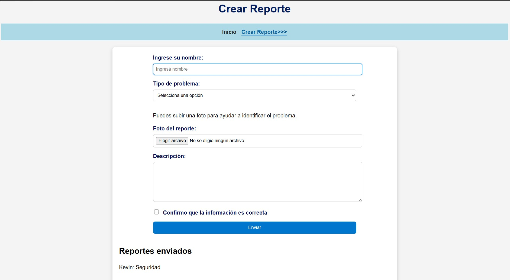

# Reporte Vecinal

Proyecto web desarrollado con HTML y CSS.
Aplicación web para registrar reportes ciudadanos.

## Funcionalidades
- Página de perfil
- Formulario para crear reportes
- Diseño responsive
- Navegación con estado activo

## Tecnologías usadas
- HTML5
- CSS3
- Flexbox
- JavaScript

## Vista del proyecto

